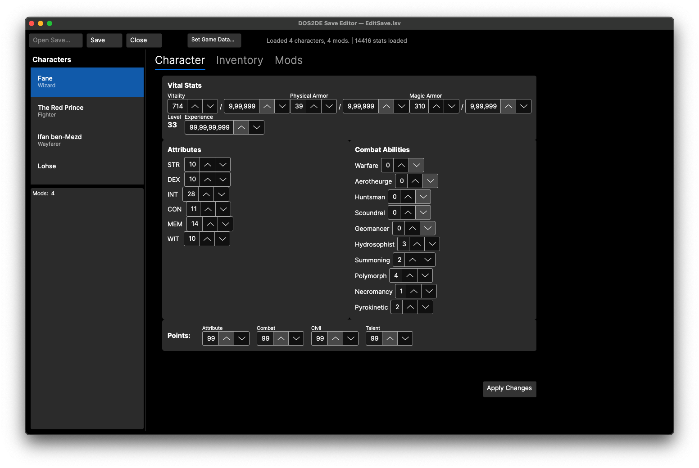
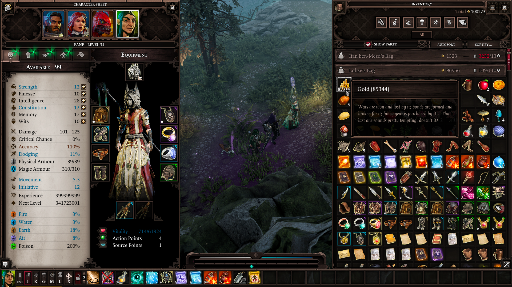

# DOS2DE Save Editor for macOS

A native macOS save game editor for **Divinity: Original Sin 2 — Definitive Edition**, built with .NET and Avalonia UI.

Edit character stats, attributes, abilities, inventory items, equipment, runes, boosters, and manage mod dependencies — all from your Mac.

<p align="center">
  
  
</p>

## Features

- **Character Editor** — Modify vital stats (VIT/ARM/MAG), attributes (STR/DEX/INT/CON/MEM/WIT), combat & civil abilities, talent points, available points, and XP/Level
- **Inventory Editor** — View all items with equipped indicators (⚔), backpack hierarchy, edit Stats ID, amount, level, runes, boosters, and equipment slot
- **Mod Manager** — View mod dependencies, remove mod data from saves
- **Safe Saves** — Auto-creates `.bak` backup before overwriting

## Requirements

- macOS 12+ (Apple Silicon or Intel)
- [.NET SDK 9.0+](https://dotnet.microsoft.com/download)

## Quick Start

```bash
# Clone with submodules
git clone --recursive https://github.com/XEonAX/dos2de-save-game-editor-macos.git
cd dos2de-save-game-editor-macos

# Build
dotnet build Dos2SaveEditor.slnx

# Launch
dotnet run --project src/Dos2SaveEditor
```

## LSLib Submodule

This project depends on [Norbyte's LSLib](https://github.com/Norbyte/lslib) for reading/writing Larian Studios file formats (LSV/PAK/LSF/LSX). We maintain a [fork](https://github.com/XEonAX/lslib) with macOS compatibility changes on the `anx/mac` branch:

- Removed `LSLibNative` C++/CLI reference (Windows-only, replaced with pure C# in `Native.cs`)
- Pure C# `FastLZCompressor` and `LZ4FrameCompressor` implementations
- Stub files for gplex/gppg parser generators (not needed for save editing)

### Setting up your own LSLib fork

1. Fork [Norbyte/lslib](https://github.com/Norbyte/lslib) on GitHub
2. Push the `anx/mac` branch from this submodule:
   ```bash
   cd lib/lslib
   git remote add myfork https://github.com/XEonAX/lslib.git
   git push myfork anx/mac
   ```
3. Update `.gitmodules` with your fork URL

## Usage

1. Launch the app
2. Click **Open Save...** and select a `.lsv` save file
3. Select a character from the left sidebar
4. Edit stats in the **Character** tab
5. Switch to **Inventory** tab to view and edit items
6. Switch to **Mods** tab to view dependencies
7. Click **Save** to write changes back (auto-creates `.bak`)

### Save File Location

Save files are typically found at:
```
~/Documents/Larian Studios/Divinity Original Sin 2 Definitive Edition/
  PlayerProfiles/<ProfileName>/Savegames/Story/<SaveName>/<SaveName>.lsv
```

> **Note:** Transfer save files from a Windows PC, Steam Cloud, or a CrossOver/Wine/Parallels installation.

## Development

```bash
# Build
dotnet build Dos2SaveEditor.slnx

# Run tests (console save parser)
dotnet run --project tests/Dos2SaveEditor.Tests -- path/to/save.lsv

# Run with auto-load (dev convenience)
DOS2_SAVE_PATH=/path/to/save.lsv dotnet run --project src/Dos2SaveEditor
```

### Project Structure

```
src/
├── Dos2SaveEditor/          # Avalonia UI app (net9.0)
│   ├── Views/               # AXAML views
│   ├── ViewModels/          # MVVM ViewModels
│   └── Converters/          # Value converters
├── Dos2SaveEditor.Core/     # Business logic (net9.0)
│   ├── Models/              # Character, Item, ModEntry
│   ├── Services/            # SavegameService, StatLookupService
│   └── Utils/               # GameConstants (XP table, ability names)
lib/
└── lslib/                   # LSLib submodule (Norbyte/lslib)
tests/
└── Dos2SaveEditor.Tests/    # Console test harness
```

## Acknowledgments

- [Norbyte/lslib](https://github.com/Norbyte/lslib) — Core library for Larian file formats
- [NovFR/DoS-2-Savegame-Editor](https://github.com/NovFR/DoS-2-Savegame-Editor) — Original Windows save editor
- [BG3SE-macOS](https://github.com/tdimino/bg3se-macos) — macOS porting reference

## License

MIT

---

*Developed with DeepSeek V4 Pro via VS Code Copilot Integration.*
